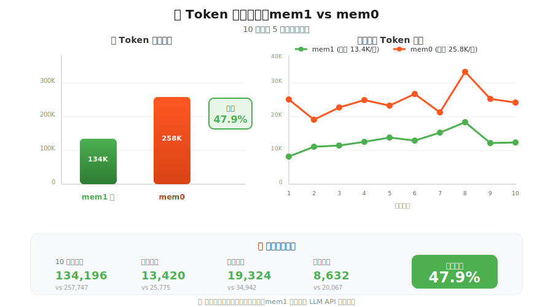

# mem1


<p align="center">
  
</p>
<p align="center">
  <strong>💬 让 AI 记住每一次对话</strong>
</p>

<p align="center">
  <strong>🔧 AI Agent 长期记忆中间件 - Java 实现</strong>
</p>

<p align="center">
  
  
  
  
</p>

<p align="center">
  
</p>

<p align="center">
  
</p>

## 简介

mem1 是一个基于 **mem0**实现的改进版记忆管理系统，能够为 AI 对话系统提供**长期记忆**、**短期记忆**与**全局摘要**能力，让 AI 记住用户偏好、历史交互和关键信息。

### 🔥 Research Highlights（研究亮点）

相较于其他竞品，mem1 在以下方面具备明显优势：

- **更高的准确度**：相较于 竞品，在多轮对话记忆任务中命中率更高、可用记忆更贴合对话意图

- **更快的速度 Faster**：更少的模型调用与更短的检索链路，规模化场景下延迟更低

- **更少的token消耗**：返回更精炼的"可用记忆 + 全局摘要"，在不牺牲效果的前提下降低上下文成本

### 📊 性能对比：Token 消耗分析

<div align="center">
  
</div>

**测试场景**: 相同对话内容下，mem1 与 mem0 在多轮对话（10轮）中的 Token 消耗对比（5次测试平均）

#### 关键指标

| 指标 | mem1 ✅ |  mem0   | 节省 |
|:------|:--------:|:-------:|:------:|
| **10轮总消耗** | 130,013 | 285,612 | **54.5% ↓** |
| **单轮平均** | 13,001 | 28,561  | **54.5% ↓** |
| **单轮峰值** | 19,931 | 40,512  | **50.8% ↓** |
| **单轮最低** | 8,137 | 16,528  | **50.8% ↓** |

> 💡 **结论**: mem1 在保持相同记忆质量的前提下，相比 mem0 可节省 **约 50% ~ 55%** 的 Token 消耗，显著降低 LLM API 调用成本。

### 核心特性

- **三层记忆架构**：短期记忆（最近对话）、长期记忆（持久化事实）、全局摘要（会话概览）
- **自动记忆抽取**：基于 LLM 自动从对话中提取关键信息
- **智能记忆更新**：支持新增（ADD）、更新（UPDATE）、删除（DELETE）、保持（NONE）四种决策
- **向量检索**：基于 Embedding 的语义相似度搜索
- **Spring Boot 自动配置**：开箱即用，最小化配置

## 快速开始

### 前置要求

- Java 21
- Maven 3.9

### 安装

在您的项目 `pom.xml` 中添加 `<repositories>` 配置：

**Maven:**

```xml
<repositories>
    <repository>
        <id>repo-ygatm</id>
        <url>https://packages.aliyun.com/69797e2a58acb3fac7af091b/maven/repo-ygatm</url>
        <releases>
            <enabled>true</enabled>
        </releases>
        <snapshots>
            <enabled>true</enabled>
        </snapshots>
    </repository>
</repositories>
```

在您的项目 `pom.xml` 中`<dependencies>`的添加以下依赖：

**Maven:**


```xml
<dependency>
  <groupId>com.memosystem</groupId>
  <artifactId>memory-system-core</artifactId>
  <version>1.0.2</version>
</dependency>

<dependency>
    <groupId>com.memosystem</groupId>
    <artifactId>memory-system-spring-boot-starter</artifactId>
    <version>1.0.2</version>
</dependency>
```

**从私有仓库拉取:**

> **两种方式：修改已有的 settings.xml 文件，或直接使用提供的 settings.xml 文件。**

**方式一**. 修改已有settings.xml文件：

**Step 1**：在 settings.xml 中新增仓库认证信息

打开 Maven 的 `settings.xml` 文件（通常位于 `~/.m2/settings.xml` 或 Maven 安装目录的 `conf/settings.xml`），在 `<servers>` 标签中添加仓库的账号密码：

```xml
<servers>
    <server>
        <id>repo-ygatm</id>
        <username>697986e7df2584eb75f9bd14</username>
        <password>ya6TP7gbT(Aw</password>
    </server>
</servers>
```

> **注意**：`<id>` 必须与后续 `<repository>` 中的 `<id>` 保持一致。

**Step 2**：在 settings.xml 中排除私有仓库的镜像代理

在 `settings.xml` 的 `<mirrors>` 标签中，修改 `<mirrorOf>` 配置，排除私有仓库（避免被镜像拦截）：

```xml
<mirrors>
    <mirror>
        <id>aliyun</id>
        <name>Aliyun Maven</name>
        <url>https://maven.aliyun.com/repository/public</url>
        <mirrorOf>*,!repo-ygatm</mirrorOf>  <!-- 关键：排除 repo-ygatm -->
    </mirror>
</mirrors>
```

> **说明**：`!repo-ygatm` 表示该镜像不代理 `repo-ygatm` 仓库，Maven 会直接访问原始地址。

**方式二**. 直接使用提供的 settings.xml 文件：

```xml
<?xml version="1.0" encoding="UTF-8"?>
<settings xmlns="http://maven.apache.org/SETTINGS/1.0.0"
          xmlns:xsi="http://www.w3.org/2001/XMLSchema-instance"
          xsi:schemaLocation="http://maven.apache.org/SETTINGS/1.0.0 http://maven.apache.org/xsd/settings-1.0.0.xsd">
    <mirrors>
        <mirror>
            <id>mirror</id>
            <mirrorOf>central,jcenter,!repo-ygatm</mirrorOf>
            <name>mirror</name>
            <url>https://maven.aliyun.com/nexus/content/groups/public</url>
        </mirror>
    </mirrors>
    <servers>
        <server>
            <id>repo-ygatm</id>
            <username>697986e7df2584eb75f9bd14</username>
            <password>ya6TP7gbT(Aw</password>
        </server>
    </servers>
    <profiles>
        <profile>
            <id>rdc</id>
            <properties>
                
                <altReleaseDeploymentRepository>
                    repo-ygatm::default::https://packages.aliyun.com/69797e2a58acb3fac7af091b/maven/repo-ygatm
                </altReleaseDeploymentRepository>
                
                
                <altSnapshotDeploymentRepository>
                    repo-ygatm::default::https://packages.aliyun.com/69797e2a58acb3fac7af091b/maven/repo-ygatm
                </altSnapshotDeploymentRepository>
                
            </properties>
            <repositories>
                <repository>
                    <id>central</id>
                    <url>https://maven.aliyun.com/nexus/content/groups/public</url>
                    <releases>
                        <enabled>true</enabled>
                    </releases>
                    <snapshots>
                        <enabled>false</enabled>
                    </snapshots>
                </repository>
                <repository>
                    <id>snapshots</id>
                    <url>https://maven.aliyun.com/nexus/content/groups/public</url>
                    <releases>
                        <enabled>false</enabled>
                    </releases>
                    <snapshots>
                        <enabled>true</enabled>
                    </snapshots>
                </repository>
                <repository>
                    <id>repo-ygatm</id>
                    <url>https://packages.aliyun.com/69797e2a58acb3fac7af091b/maven/repo-ygatm</url>
                    <releases>
                        <enabled>true</enabled>
                    </releases>
                    <snapshots>
                        <enabled>true</enabled>
                    </snapshots>
                </repository>
            </repositories>
            <pluginRepositories>
                <pluginRepository>
                    <id>central</id>
                    <url>https://maven.aliyun.com/nexus/content/groups/public</url>
                    <releases>
                        <enabled>true</enabled>
                    </releases>
                    <snapshots>
                        <enabled>false</enabled>
                    </snapshots>
                </pluginRepository>
                <pluginRepository>
                    <id>snapshots</id>
                    <url>https://maven.aliyun.com/nexus/content/groups/public</url>
                    <releases>
                        <enabled>false</enabled>
                    </releases>
                    <snapshots>
                        <enabled>true</enabled>
                    </snapshots>
                </pluginRepository>
                <pluginRepository>
                    <id>repo-ygatm</id>
                    <url>https://packages.aliyun.com/69797e2a58acb3fac7af091b/maven/repo-ygatm</url>
                    <releases>
                        <enabled>true</enabled>
                    </releases>
                    <snapshots>
                        <enabled>true</enabled>
                    </snapshots>
                </pluginRepository>
            </pluginRepositories>
        </profile>
    </profiles>
    <activeProfiles>
        <activeProfile>rdc</activeProfile>
    </activeProfiles>
</settings>

```

**配置 YAML**

在 `application.yaml` 中添加以下配置：

```yaml
# LLM 配置
llm:
  api-key: ${LLM_API_KEY:your-api-key}                    # 通过环境变量配置（必填）
  api-url: ${LLM_API_URL:https://api.deepseek.ai/v1}      # LLM API 服务地址
  default-model: ${LLM_MODEL:deepseek-v3-2-251201}        # 默认模型
  memory-extraction-model: ${LLM_MODEL:deepseek-v3-2-251201}  # 记忆抽取模型
  decision-model: ${LLM_MODEL:deepseek-v3-2-251201}       # 决策模型
  global-memory-model: ${LLM_MODEL:deepseek-v3-2-251201}  # 全局摘要模型
  connect-timeout: 10                                      # 连接超时（秒）
  api-timeout: 30                                          # API 调用超时（秒）
  chat-temperature: 0.7                                    # 聊天温度
  memory-extraction-temperature: 0.0                       # 记忆提取温度
  decision-temperature: 0.0                                # 决策温度
  max-tokens: 2000                                         # 最大 token 数

# 记忆系统配置
memory:
  conversation-search-top-k: 3        # 对话服务检索记忆数量
  update-search-top-k: 5              # 记忆更新检索记忆数量
  short-term-memory-size: 10          # 短期记忆容量（对话轮数）
  db-path: ./qdrant                   # 向量数据库路径
  collections-dir: collections        # 集合目录名
  collection-name: memories           # 记忆集合名称
  api:
    prefix: /api/conversation         # API 路径前缀
  thread-pool:
    core-size: 5                      # 核心线程数
    max-size: 10                      # 最大线程数
    keep-alive-seconds: 60            # 线程空闲时间（秒）
    queue-capacity: 100               # 任务队列大小
```

### 基本用法

在你的 Spring Boot 项目中注入 `ConversationService` 并调用：

```java
import com.memosystem.service.ConversationService;
import com.memosystem.common.model.Result;
import org.springframework.beans.factory.annotation.Autowired;

@Service
public class YourChatService {

    @Autowired
    private ConversationService conversationService;

    public String chat(String sessionId, String userMessage) {
        // 1. 获取带记忆的提示词
        String prompt = conversationService.getPrompt(sessionId, userMessage);

        // 2. 调用你的 AI 服务
        String aiResponse = yourAIService.chat(prompt);

        // 3. 保存到记忆系统
        Result<String> result = conversationService.updateSystemContext(
            sessionId, 
            userMessage, 
            aiResponse
        );

        return aiResponse;
    }
}
```

## API 参考

---

`getPrompt` - 获取上下文记忆 

```java
String prompt = conversationService.getPrompt(sessionId, userMessage);
```

**功能说明**：

- 根据用户消息检索相关的长期记忆
- 加载当前会话的短期记忆（最近对话）
- 获取全局摘要上下文
- 将所有记忆信息整合后返回

**返回值**：详细的上下文记忆，可拼接其他提示词用于 LLM 调用。

`updateSystemContext` - 更新系统记忆

```java
Result<String> result = conversationService.updateSystemContext(sessionId, userMessage, aiResponse);
```

**功能说明**：
- 保存当前对话到短期记忆
- 从对话中抽取关键事实（Fact Extraction）
- 与现有长期记忆进行对比决策（ADD/UPDATE/DELETE/NONE）
- 更新全局摘要

**返回值**：`Result<String>` 对象，包含操作结果和消息。

## 项目结构

> **项目详细结构**:[DETAILED_GUIDE.md](DETAILED_GUIDE.md)

## 语言支持

- **中文**: [README-ZH.md](README-ZH.md) (本文件)
- **English**: [README.md](README.md)

## 许可证

Apache 2.0 - 详见 [LICENSE.md](LICENSE.md) 文件。

## 致谢

本项目为源项目[mem0 Python 实现](https://github.com/mem0ai/mem0) 的Java开发版。