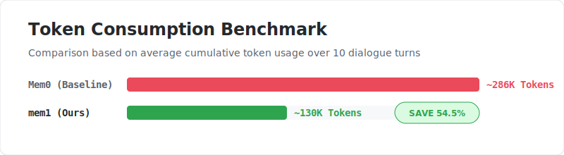
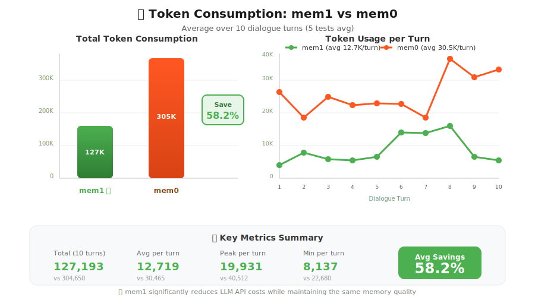

# mem1


<p align="center">
  
</p>

<p align="center">
  <strong>💬 Enable AI to Remember Every Conversation</strong>
</p>

<p align="center">
  <strong>🔧 AI Agent Long-Term Memory Middleware - Java Implementation</strong>
</p>

<p align="center">
  
  
  
  
</p>

<p align="center">
  
</p>

<p align="center">
  
</p>

## Introduction

mem1 is an improved memory management system based on **mem0**, providing **long-term memory**, **short-term memory**, and **global summary** capabilities for AI conversational systems, enabling AI to remember user preferences, interaction history, and key information.

### 🔥 Research Highlights

Compared to other competitors, mem1 has significant advantages in the following aspects:

- **Higher Accuracy**: Compared to competitors, it achieves higher hit rates and more relevant memory in multi-turn dialogue memory tasks

- **Faster Speed**: Fewer model calls and shorter retrieval chains result in lower latency in large-scale scenarios

- **Less Token Consumption**: Returns more refined "available memory + global summary", reducing context costs without sacrificing effectiveness

### 📊 Performance Comparison: Token Consumption Analysis

<div align="center">
  
</div>

**Test Scenario**: Token consumption comparison between mem1 and mem0 in multi-turn dialogues (10 turns), averaged over 5 tests

#### Key Metrics

| Metric | mem1 ✅ |  mem0   | Savings |
|:------|:--------:|:-------:|:------:|
| **Total (10 turns)** | 130,013 | 285,612 | **54.5% ↓** |
| **Avg per turn** | 13,001 | 28,561  | **54.5% ↓** |
| **Peak per turn** | 19,931 | 40,512  | **50.8% ↓** |
| **Min per turn** | 8,137 | 16,528  | **50.8% ↓** |

> 💡 **Conclusion**: mem1 can save approximately **50% ~ 55%** in token consumption compared to mem0, while maintaining the same memory quality, significantly reducing LLM API costs.

### Core Features

- **Three-Layer Memory Architecture**: Short-term memory (recent conversations), long-term memory (persisted facts), global summary (session overview)
- **Automatic Memory Extraction**: LLM-based automatic extraction of key information from conversations
- **Intelligent Memory Updates**: Supports four decision types - ADD, UPDATE, DELETE, NONE
- **Vector Retrieval**: Semantic similarity search based on embeddings
- **Spring Boot Auto-Configuration**: Out-of-the-box with minimal configuration

## Quick Start

### Prerequisites

- Java 21
- Maven 3.9

### Installation

Add the `<repositories>` configuration to your project's `pom.xml`:

**Maven:**

```xml
<repositories>
    <repository>
        <id>repo-ygatm</id>
        <url>https://packages.aliyun.com/69797e2a58acb3fac7af091b/maven/repo-ygatm</url>
        <releases>
            <enabled>true</enabled>
        </releases>
        <snapshots>
            <enabled>true</enabled>
        </snapshots>
    </repository>
</repositories>
```

Add the following dependencies in `<dependencies>`:

**Maven:**


```xml
<dependency>
  <groupId>com.memosystem</groupId>
  <artifactId>memory-system-core</artifactId>
  <version>1.0.2</version>
</dependency>

<dependency>
    <groupId>com.memosystem</groupId>
    <artifactId>memory-system-spring-boot-starter</artifactId>
    <version>1.0.2</version>
</dependency>
```

**Pulling from Private Repository:**

> **Two methods: Modify existing settings.xml file, or use the provided settings.xml file directly.**

**Method 1**. Modify existing settings.xml file:

**Step 1**: Add repository authentication information in `settings.xml`

Open Maven's `settings.xml` file (usually located at `~/.m2/settings.xml` or Maven installation directory `conf/settings.xml`), and add the repository username and password in the `<servers>` tag:

```xml
<servers>
    <server>
        <id>repo-ygatm</id>
        <username>697986e7df2584eb75f9bd14</username>
        <password>ya6TP7gbT(Aw</password>
    </server>
</servers>
```

> **Note**: `<id>` must match the `<id>` in the subsequent `<repository>`.

**Step 2**: Exclude private repository from mirror proxy in `settings.xml`

In the `<mirrors>` tag of `settings.xml`, modify `<mirrorOf>` configuration to exclude the private repository (avoid being intercepted by mirrors):

```xml
<mirrors>
    <mirror>
        <id>aliyun</id>
        <name>Aliyun Maven</name>
        <url>https://maven.aliyun.com/repository/public</url>
        <mirrorOf>*,!repo-ygatm</mirrorOf>  <!-- Key: exclude repo-ygatm -->
    </mirror>
</mirrors>
```

> **Explanation**: `!repo-ygatm` means this mirror does not proxy `repo-ygatm` repository, and Maven will directly access the original address.

**Method 2**. Use the provided settings.xml file directly:

```xml
<?xml version="1.0" encoding="UTF-8"?>
<settings xmlns="http://maven.apache.org/SETTINGS/1.0.0"
          xmlns:xsi="http://www.w3.org/2001/XMLSchema-instance"
          xsi:schemaLocation="http://maven.apache.org/SETTINGS/1.0.0 http://maven.apache.org/xsd/settings-1.0.0.xsd">
    <mirrors>
        <mirror>
            <id>mirror</id>
            <mirrorOf>central,jcenter,!repo-ygatm</mirrorOf>
            <name>mirror</name>
            <url>https://maven.aliyun.com/nexus/content/groups/public</url>
        </mirror>
    </mirrors>
    <servers>
        <server>
            <id>repo-ygatm</id>
            <username>697986e7df2584eb75f9bd14</username>
            <password>ya6TP7gbT(Aw</password>
        </server>
    </servers>
    <profiles>
        <profile>
            <id>rdc</id>
            <properties>
                
                <altReleaseDeploymentRepository>
                    repo-ygatm::default::https://packages.aliyun.com/69797e2a58acb3fac7af091b/maven/repo-ygatm
                </altReleaseDeploymentRepository>
                
                
                <altSnapshotDeploymentRepository>
                    repo-ygatm::default::https://packages.aliyun.com/69797e2a58acb3fac7af091b/maven/repo-ygatm
                </altSnapshotDeploymentRepository>
                
            </properties>
            <repositories>
                <repository>
                    <id>central</id>
                    <url>https://maven.aliyun.com/nexus/content/groups/public</url>
                    <releases>
                        <enabled>true</enabled>
                    </releases>
                    <snapshots>
                        <enabled>false</enabled>
                    </snapshots>
                </repository>
                <repository>
                    <id>snapshots</id>
                    <url>https://maven.aliyun.com/nexus/content/groups/public</url>
                    <releases>
                        <enabled>false</enabled>
                    </releases>
                    <snapshots>
                        <enabled>true</enabled>
                    </snapshots>
                </repository>
                <repository>
                    <id>repo-ygatm</id>
                    <url>https://packages.aliyun.com/69797e2a58acb3fac7af091b/maven/repo-ygatm</url>
                    <releases>
                        <enabled>true</enabled>
                    </releases>
                    <snapshots>
                        <enabled>true</enabled>
                    </snapshots>
                </repository>
            </repositories>
            <pluginRepositories>
                <pluginRepository>
                    <id>central</id>
                    <url>https://maven.aliyun.com/nexus/content/groups/public</url>
                    <releases>
                        <enabled>true</enabled>
                    </releases>
                    <snapshots>
                        <enabled>false</enabled>
                    </snapshots>
                </pluginRepository>
                <pluginRepository>
                    <id>snapshots</id>
                    <url>https://maven.aliyun.com/nexus/content/groups/public</url>
                    <releases>
                        <enabled>false</enabled>
                    </releases>
                    <snapshots>
                        <enabled>true</enabled>
                    </snapshots>
                </pluginRepository>
                <pluginRepository>
                    <id>repo-ygatm</id>
                    <url>https://packages.aliyun.com/69797e2a58acb3fac7af091b/maven/repo-ygatm</url>
                    <releases>
                        <enabled>true</enabled>
                    </releases>
                    <snapshots>
                        <enabled>true</enabled>
                    </snapshots>
                </pluginRepository>
            </pluginRepositories>
        </profile>
    </profiles>
    <activeProfiles>
        <activeProfile>rdc</activeProfile>
    </activeProfiles>
</settings>

```

**YAML Configuration**

Add the following configuration to `application.yaml`:

```yaml
# LLM Configuration
llm:
  api-key: ${LLM_API_KEY:your-api-key}                    # Configure via environment variable (required)
  api-url: ${LLM_API_URL:https://api.deepseek.ai/v1}      # LLM API service URL
  default-model: ${LLM_MODEL:deepseek-v3-2-251201}        # Default model
  memory-extraction-model: ${LLM_MODEL:deepseek-v3-2-251201}  # Memory extraction model
  decision-model: ${LLM_MODEL:deepseek-v3-2-251201}       # Decision model
  global-memory-model: ${LLM_MODEL:deepseek-v3-2-251201}  # Global summary model
  connect-timeout: 10                                      # Connection timeout (seconds)
  api-timeout: 30                                          # API call timeout (seconds)
  chat-temperature: 0.7                                    # Chat temperature
  memory-extraction-temperature: 0.0                       # Memory extraction temperature
  decision-temperature: 0.0                                # Decision temperature
  max-tokens: 2000                                         # Maximum tokens

# Memory System Configuration
memory:
  conversation-search-top-k: 3        # Number of memories to retrieve for conversation
  update-search-top-k: 5              # Number of memories to retrieve for updates
  short-term-memory-size: 10          # Short-term memory capacity (conversation turns)
  db-path: ./qdrant                   # Vector database path
  collections-dir: collections        # Collections directory name
  collection-name: memories           # Memory collection name
  api:
    prefix: /api/conversation         # API path prefix
  thread-pool:
    core-size: 5                      # Core thread pool size
    max-size: 10                      # Maximum thread pool size
    keep-alive-seconds: 60            # Thread idle time (seconds)
    queue-capacity: 100               # Task queue size
```

### Basic Usage

Inject `ConversationService` in your Spring Boot project and call it:

```java
import com.memosystem.service.ConversationService;
import com.memosystem.common.model.Result;
import org.springframework.beans.factory.annotation.Autowired;

@Service
public class YourChatService {

    @Autowired
    private ConversationService conversationService;

    public String chat(String sessionId, String userMessage) {
        // 1. Get memory-enhanced prompt
        String prompt = conversationService.getPrompt(sessionId, userMessage);

        // 2. Call your AI service
        String aiResponse = yourAIService.chat(prompt);

        // 3. Save to memory system
        Result<String> result = conversationService.updateSystemContext(
            sessionId, 
            userMessage, 
            aiResponse
        );

        return aiResponse;
    }
}
```

## API Reference

---

`getPrompt` - Get Context Memory 

```java
String prompt = conversationService.getPrompt(sessionId, userMessage);
```

**Description**:

- Retrieves relevant long-term memories based on user message
- Loads short-term memory (recent conversations) for current session
- Fetches global summary context
- Integrates all memory information and returns

**Returns**: Detailed context memory, can be concatenated with other prompts for LLM invocation.

`updateSystemContext` - Update System Memory

```java
Result<String> result = conversationService.updateSystemContext(sessionId, userMessage, aiResponse);
```

**Description**:
- Saves current conversation to short-term memory
- Extracts key facts from conversation (Fact Extraction)
- Compares with existing long-term memories and makes decisions (ADD/UPDATE/DELETE/NONE)
- Updates global summary

**Returns**: `Result<String>` object, containing operation result and message.

## Project Structure

> **Detailed Project Structure**: [DETAILED_GUIDE.md](DETAILED_GUIDE.md)

## Language Support

- **中文**: [README-ZH.md](README-ZH.md)
- **English**: [README.md](README.md) (This file)

## License

Apache 2.0 - See [LICENSE.md](LICENSE.md) file for details.

## Acknowledgements

This project is a Java development version of the original [mem0 Python Implementation](https://github.com/mem0ai/mem0).
